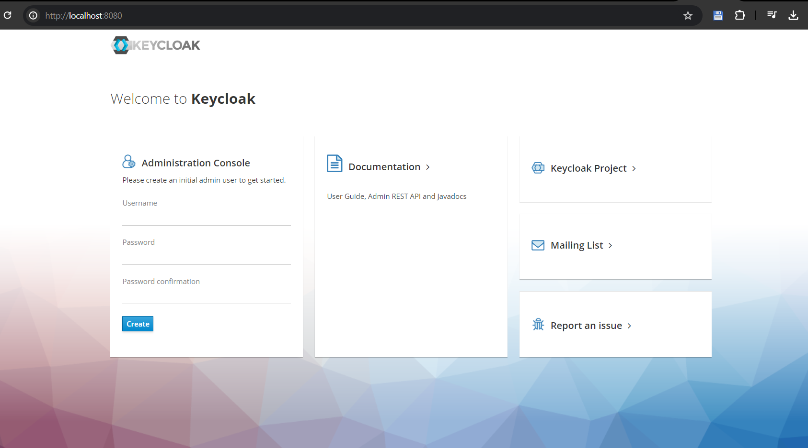
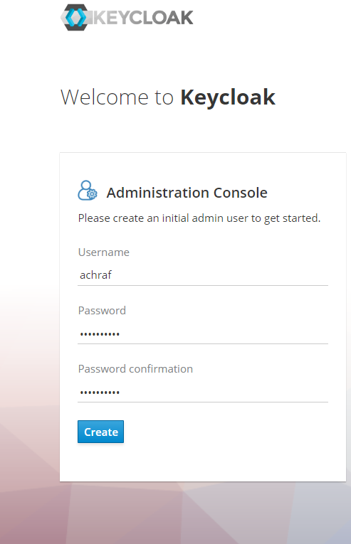
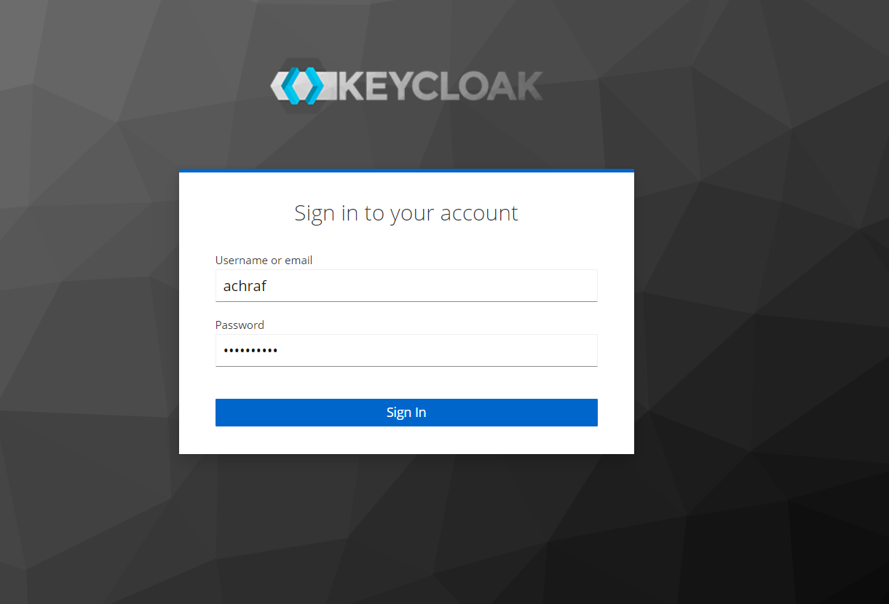
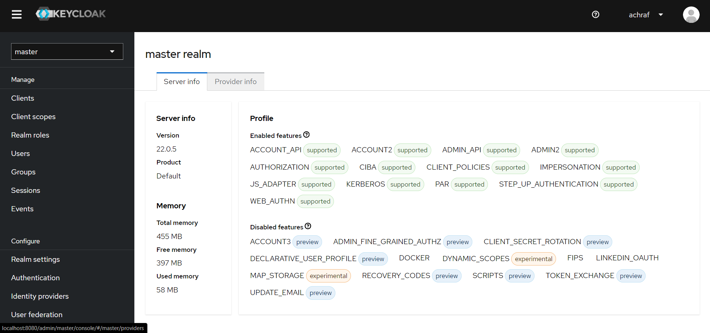

Keycloak (Activité pratique)
========

1) Try Keycloak out in development mode, run: 
on Windows:
    $ bin\kc.bat start-dev
2) After the server boots, open http://localhost:8080 in your web browser. The welcome page will indicate that the server is running.
# 
3) SignUp
# 
4) Login
# 
5) Keyclock dashbord
# 
